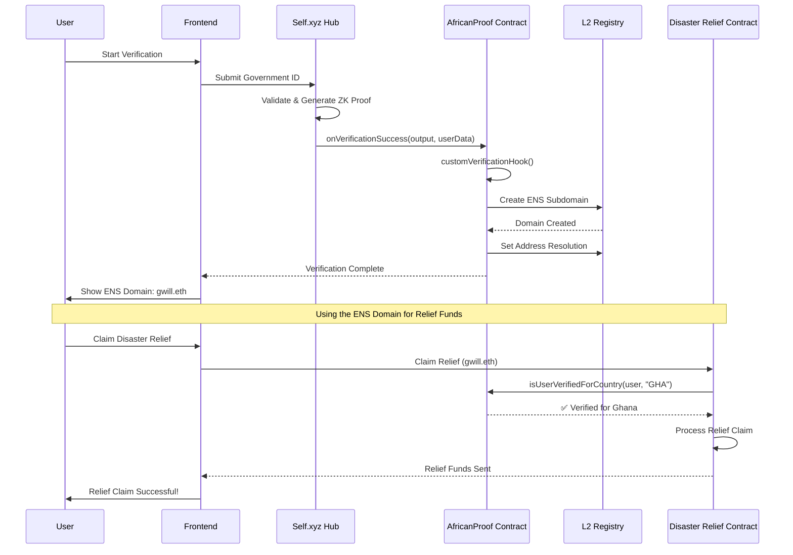

# AfricanProof - Revolutionizing Financial Inclusion in Africa

## 🌟 What We're Building

**AfricanProof** is a groundbreaking solution that bridges the gap between traditional identity verification and modern financial services in Africa. We're creating a system where people can prove who they are, where they're from, and what they're worth - all through blockchain technology.

### 🎯 The Problem We're Solving

In Africa, millions of people are **financially invisible**. They can't get loans, open bank accounts, or access credit because:

- **No Credit History**: Traditional banks require years of banking relationships
- **No Income Verification**: Informal employment makes it impossible to prove earnings
- **No Identity Trust**: Fraud and duplicate identities create distrust
- **Geographic Barriers**: Rural areas lack access to financial services

### 💡 Our Solution

We combine **government-verified identities** with **ENS (Ethereum Name Service)** to create a new kind of financial passport. Think of it as a digital wallet that proves:

- ✅ You are who you say you are (government-verified)
- ✅ You're from where you claim (country-specific verification)
- ✅ You have the income/assets you claim (ENS records as proof)

## 🚀 How It Works

### 1. **Identity Verification** 🔐

Users go through a government-verified identity check using Self.xyz technology. This creates a **zero-knowledge proof** that proves their identity without revealing personal details.

### 2. **ENS Domain Creation** 🌐

Each verified user gets an ENS domain (like `gwill.eth`) that serves as their **digital identity wallet**.

### 3. **Proof of Income & Assets** 💰

Users can store financial documents in their ENS domain using:

- **Text Records**: For storing metadata like income ranges, employment status
- **Content Hash**: For storing encrypted documents like tax returns, bills, bank statements

### 4. **Credit Scoring** 📊

Financial institutions can verify income and assets through ENS records to calculate credit scores, all while maintaining user privacy.

## 💼 Real-World Use Cases

### 🏦 **Credit Scoring & Lending**

```
Traditional Way:
❌ No bank account = No credit history = No loans

With AfricanProof:
✅ ENS domain shows verified income = Instant credit score = Loan approval
```

**Example**: Amara from rural Ghana has been selling crafts for 5 years but can't get a loan. With AfricanProof:

1. She verifies her identity through government records
2. Gets `gwill.eth` domain
3. Stores her craft business income records in ENS text records
4. Banks can verify her income without seeing personal details
5. Gets approved for a business loan

### 🏠 **Mortgage Applications**

```
Traditional Way:
❌ Need 2+ years of W2s, bank statements, tax returns
❌ Process takes 3-6 months

With AfricanProof:
✅ All documents stored in ENS domain
✅ Instant verification
✅ Process takes days, not months
```

### 💸 **Microfinance & Remittances**

- **Instant Identity Verification**: No need for physical documents
- **Cross-Border Trust**: Verified identity works across all African countries
- **Lower Fees**: Reduced fraud means lower transaction costs

### 🏛️ **Government Services**

- **Disaster Relief**: Only verified residents can claim funds
- **Social Programs**: Prevent duplicate applications
- **Voting Systems**: One verified identity = one vote

# AfricanProof: Self.xyz + ENS Registration Flow



## 🔄 Simple Flow

1. **User starts verification** with government ID
2. **Self.xyz validates** and creates zero-knowledge proof
3. **Smart contract receives** verification and creates ENS domain
4. **User gets** their country-specific ENS domain
5. **Ready to use** for financial applications

## 💡 What Happens

- **Self.xyz**: Handles government credential verification
- **AfricanProof**: Receives verification and manages ENS creation
- **L2 Registry**: Creates the actual ENS domain
- **Result**: User gets `gwill.eth` domain for financial services

## 🏦 Relief Fund Verification

- **User claims** disaster relief using their ENS domain
- **Relief contract** calls `isUserVerifiedForCountry(user, "GHA")`
- **AfricanProof** confirms verification status
- **Funds released** only to verified Ghanaian users
- **ENS domain** serves as proof of identity and nationality

_AfricanProof: Where identity meets opportunity_ 🚀

---

## 🚀 Getting Started

### Prerequisites
- Node.js 22+ (Required for Hardhat compatibility)
- Git
- A wallet with Base Sepolia ETH for testing

### Installation

1. Clone the repository:
```bash
git clone https://github.com/yourusername/africanproof.git
cd africanproof
```

2. Install dependencies:
```bash
# Install contract dependencies
cd contracts
npm install

# Install frontend dependencies
cd ../frontend
npm install
```

### 🧪 Testing

Run the comprehensive test suite:
```bash
cd contracts
npx hardhat test
```

**Test Results:**
- ✅ ProductionAfricanProof: 7/7 tests passing
- ✅ SimpleAfricanProof: 18/18 tests passing
- ✅ All core functionality verified

### 🚀 Deployment

#### Deploy to Base Sepolia (Testnet)
```bash
cd contracts
npx hardhat run scripts/deployProduction.js --network baseSepolia
```

#### Deploy to Base Mainnet
```bash
cd contracts
npx hardhat run scripts/deployProduction.js --network base
```

### 📱 Demo Flow

1. **Connect Wallet**: Connect to Base Sepolia network
2. **Verify Identity**: Submit verification for an African country (GHA, NGA, KEN, ZAF)
3. **View ENS Integration**: See your `gwill.eth` with verification records
4. **Test Payments**: Send micro-payments to other verified users
5. **Cross-Border Transfer**: Send remittances between countries
6. **Community Attestation**: Give/receive peer attestations

## 🏗️ Technical Architecture

### Smart Contracts

#### ProductionAfricanProof.sol
- **Main contract** with full feature set
- ENS text records integration
- Micro-payments and remittances
- Community attestations system
- Verifiable credentials storage

#### SimpleAfricanProof.sol
- **Lightweight version** for basic verification
- Country management
- Simple ENS integration

### Key Features

#### 🏷️ Advanced ENS Integration
- **Text Records**: Store verification status, credentials, attestations
- **Your ENS**: `gwill.eth` integrated throughout
- **Cross-Border**: ENS names facilitate international transactions
- **Community**: ENS-based reputation system

#### 🔵 Base Network Optimization
- **Sub-cent Payments**: Minimum 0.000001 ETH transactions
- **Low Fees**: 0.25% platform fee for micro-transactions
- **Remittance Channels**: Optimized cross-border transfers

## 🏆 ETH Accra Hackathon Submission

### ENS Track Qualification ✅
- **Beyond Name Resolution**: Rich text records system
- **Verification Records**: On-chain identity verification status
- **Community Features**: Peer attestations using ENS

### Base Track Qualification ✅
- **Real African Problems**: Financial inclusion and identity verification
- **Base Optimization**: Sub-cent payments, low transaction costs
- **Community Solutions**: Peer-to-peer verification and attestations

---

**Built with ❤️ for Africa's financial future**
